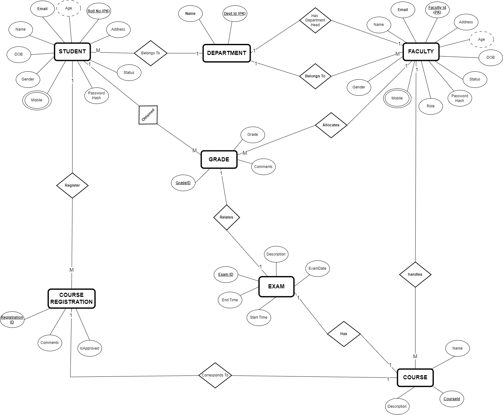

# STUDENT MANAGEMENT SYSTEM API

The Student Management System is a comprehensive web-based API application designed to streamline the management of student data and academic activities.

## ERD Diagram



You can also find the ERD Diagram [here](./ERD.png)

## Table of Contents
- [Student Management System API](#student-management-system-api)
  - [ERD Diagram](#erd-diagram)
  - [Table of Contents](#table-of-contents)
  - [Overview](#overview)
  - [Expected Features](#expected-features)
    - [User Management](#user-management)
    - [Student Management](#student-management)
    - [Faculty Management](#faculty-management)
    - [Course Management](#course-management)
    - [Exam Management](#exam-management)
    - [Attendance Management](#attendance-management)
    - [Administrative Functions (Admin User)](#administrative-functions-admin-user)
  - [Technologies Used](#technologies-used)
  - [Project Structure](#project-structure)
  - [Getting Started](#getting-started)
    - [Prerequisites](#prerequisites)
    - [Installation](#installation)
    - [Configuration](#configuration)
    - [Running the Application](#running-the-application)
  - [API Endpoints](#api-endpoints)
    - [Auth Endpoints](#auth-endpoints)
    - [Student Endpoints](#student-endpoints)
    - [Faculty Endpoints](#faculty-endpoints)
    - [Course Endpoints](#course-endpoints)
    - [Exam Endpoints](#exam-endpoints)
    - [Attendance Endpoints](#attendance-endpoints)
    - [Admin Endpoints](#admin-endpoints)
  - [Testing](#testing)
    - [Running Tests](#running-tests)
    - [Coverage Report](#coverage-report)
  - [Relevant Repo](#relevant-repo)

## Overview
The **Student Management System** is a web-based backend application built using ASP.NET Core Web API for creating RESTful services. It provides essential functionalities for managing student data, courses, exams, and attendance. The application uses Entity Framework Core for data management, a Service layer for business logic, and incorporates JSON Web Tokens (JWT) for authentication. API documentation can be created through Swagger and Postman.

## Expected Features

### User Management
- **User Registration**: Users can register for a new account by providing necessary details. The account will be activated by an admin after background verification.
- **User Login/Sessions**: Users can log in to their accounts securely, and sessions are handled with JWT tokens. 

### Student Management
- **Add Student**: Students will register themselves to the system. Admin will approve them.
- **View Student Details**: Users can view details of students, including their academic records.
- **Update Student Information**: Student can update student information.
- **Delete Student**: Admin can delete a student from the system.

### Faculty Management
- **Add Faculty**: Faculties will register themselves to the system. Admin will approve them.
- **View Faculty Details**: Users can view details of faculty members.
- **Update Faculty Information**: Each Faculty can update faculty information.
- **Delete Faculty**: Admin can delete a faculty member from the system.

### Course Management
- **Add Course**: Admin can add new courses to the system.
- **View Course Details**: Users can view details of courses.
- **Update Course Information**: Admin can update course information.
- **Delete Course**: Admin can delete a course from the system.

### Exam Management
- **Schedule Exam**: Admin can schedule exams for courses.
- **View Exam Details**: Users can view details of scheduled exams.
- **Update Exam Information**: Admin can update exam information.
- **Delete Exam**: Admin can delete an exam from the system.

### Attendance Management
- **Record Attendance**: Faculty can record student attendance for courses.
- **View Attendance Records**: Users can view attendance records.
- **Update Attendance Records**: Admin can update attendance records.
- **Delete Attendance Records**: Admin can delete attendance records.

### Administrative Functions (Admin User)
- **View All Users**: Admin users can view a list of all registered users.
- **Manage User Accounts**: Admin users can manage user accounts, such as activating, deactivating, or deleting user accounts.

## Technologies Used
- **ASP.NET Core Web API**
- **Entity Framework Core**
- **SQL Server**
- **JSON Web Tokens (JWT) for authentication**
- **Swagger & Postman for API documentation**


## Project Structure
The project follows a layered architecture to separate concerns and improve maintainability:
- **Controllers**: Handle HTTP requests and responses.
- **Services**: Business logic layer.
- **Repositories**: Data access layer.
- **Models**: Define database entities.
- **DTOs**: Data Transfer Objects for communication between layers.
- **Mappers**: For auto-mapping functionality between DTOs and models.
- **Enums**: Define enumerations used throughout the application.
- **ErrorModels**: Models for error handling and reporting.
- **Migrations**: Database migrations for managing schema changes.
- **Exceptions**: Custom exceptions used in the application.
- **Contexts**: Database context classes for Entity Framework Core.
- **log4net.config**: Configuration file for logging using log4net.
- **Testing**: Contains unit tests for repositories and services.
  - **Repository Tests**
  - **Service Tests**

## Getting Started

### Prerequisites
- [.NET 6 SDK](https://dotnet.microsoft.com/download/dotnet/6.0)
- [SQL Server](https://www.microsoft.com/en-us/sql-server/sql-server-downloads)

### Installation
1. **Clone the Repository**
   ```sh
   git clone https://github.com/RajKousik/Mini_Project_Backend_GenSpark
   cd StudentManagementSolution
   ```

2. **Restore Dependencies**
   ```sh
   dotnet restore
   ```

3. **Update Database**
   ```sh
   dotnet ef database update
   ```

### Configuration
Configure your application settings in `appsettings.json`:
```json
{
  "Logging": {
    "LogLevel": {
      "Default": "Information",
      "Microsoft.AspNetCore": "Warning"
    }
  },
  "ConnectionStrings": {
    "DefaultConnection": "<DB_CONNECTION_STRING>"
  },
  "TokenKey": {
    "JWT": "<SECRET_KEY>"
  },
  "AllowPasswordValidation": false, //if you need password validation, then assign it as true
  "AllowedHosts": "*"
}
```

### Running the Application
1. **Run the API**
   ```sh
   dotnet run --project StudentManagementSolution
   ```

2. **Access the API**
   Open your browser and navigate to `https://localhost:5001/swagger` to explore the API documentation.

## API Endpoints

Here are all the API endpoints from your Swagger documentation:

### Admin Endpoints
1. **Activate Faculty**
   - `PUT /api/v1/admin/activate/faculty`
   - Parameters: `email` (query, string)
   - Responses: 200 (Success), 400 (Bad Request), 404 (Not Found), 500 (Server Error)

2. **Activate Student**
   - `PUT /api/v1/admin/activate/student`
   - Parameters: `email` (query, string)
   - Responses: 200 (Success), 400 (Bad Request), 404 (Not Found), 500 (Server Error)

### Course Endpoints
3. **Create Course**
   - `POST /api/v1/courses`
   - Request Body: `CourseDTO`
   - Responses: 200 (Success, returns `CourseReturnDTO`), 400 (Bad Request), 404 (Not Found), 409 (Conflict), 500 (Server Error)

4. **Get All Courses**
   - `GET /api/v1/courses`
   - Responses: 200 (Success, returns array of `CourseReturnDTO`), 404 (Not Found), 500 (Server Error)

5. **Get Course by ID**
   - `GET /api/v1/courses/{courseId}`
   - Parameters: `courseId` (path, integer, required)
   - Responses: 200 (Success, returns `CourseReturnDTO`), 404 (Not Found), 500 (Server Error)

6. **Update Course by ID**
   - `PUT /api/v1/courses/{courseId}`
   - Parameters: `courseId` (path, integer, required)
   - Request Body: `CourseDTO`
   - Responses: 200 (Success, returns `CourseReturnDTO`), 400 (Bad Request), 404 (Not Found), 500 (Server Error)

7. **Get Courses by Name**
   - `GET /api/v1/courses/name`
   - Parameters: `name` (query, string)
   - Responses: 200 (Success, returns array of `CourseReturnDTO`), 404 (Not Found), 500 (Server Error)

8. **Get Courses by Faculty ID**
   - `GET /api/v1/courses/facultyId`
   - Parameters: `facultyId` (query, integer)
   - Responses: 200 (Success, returns array of `CourseReturnDTO`), 404 (Not Found), 500 (Server Error)

### Course Registration Endpoints
9. **Create Course Registration**
   - `POST /api/v1/course-registrations`
   - Request Body: `CourseRegistrationAddDTO`
   - Responses: 201 (Created, returns `CourseRegistrationReturnDTO`), 400 (Bad Request), 404 (Not Found), 409 (Conflict), 500 (Server Error)

10. **Get All Course Registrations**
    - `GET /api/v1/course-registrations`
    - Responses: 200 (Success, returns array of `CourseRegistrationReturnDTO`), 404 (Not Found), 500 (Server Error)

11. **Delete Course Registration**
    - `DELETE /api/v1/course-registrations`
    - Parameters: `courseRegistrationId` (query, integer)
    - Responses: 200 (Success, returns `CourseRegistrationReturnDTO`), 404 (Not Found), 500 (Server Error)

12. **Get Course Registration by ID**
    - `GET /api/v1/course-registrations/{courseRegistrationId}`
    - Parameters: `courseRegistrationId` (path, integer, required)
    - Responses: 200 (Success, returns `CourseRegistrationReturnDTO`), 404 (Not Found), 500 (Server Error)

13. **Update Course Registration**
    - `PUT /api/v1/course-registrations/update`
    - Parameters: `courseRegistrationId` (query, integer), `courseId` (query, integer)
    - Responses: 200 (Success, returns `CourseRegistrationReturnDTO`), 400 (Bad Request), 404 (Not Found), 409 (Conflict), 500 (Server Error)

14. **Get Course Registrations by Student ID**
    - `GET /api/v1/course-registrations/student`
    - Parameters: `studentId` (query, integer)
    - Responses: 200 (Success, returns array of `CourseRegistrationReturnDTO`), 404 (Not Found), 500 (Server Error)

15. **Get Course Registrations by Course ID**
    - `GET /api/v1/course-registrations/course`
    - Parameters: `courseId` (query, integer)
    - Responses: 200 (Success, returns array of `CourseRegistrationReturnDTO`), 404 (Not Found), 500 (Server Error)

16. **Approve Course Registration**
    - `PUT /api/v1/course-registrations/approve`
    - Parameters: `courseRegistrationId` (query, integer)
    - Responses: 200 (Success, returns `CourseRegistrationReturnDTO`), 400 (Bad Request), 404 (Not Found), 409 (Conflict), 500 (Server Error)

17. **Approve Course Registrations for Student**
    - `PUT /api/v1/course-registrations/approve-registrations`
    - Parameters: `studentId` (query, integer)
    - Responses: 200 (Success, returns array of `CourseRegistrationReturnDTO`), 400 (Bad Request), 404 (Not Found), 409 (Conflict), 500 (Server Error)

17. **Approve Course Registrations for Student**
    - `PUT /api/v1/course-registrations/approve-registrations`
    - Parameters: `studentId` (query, integer)
    - Responses: 
        - 200: Success. Returns an array of `CourseRegistrationReturnDTO`.
        - 400: Bad Request.
        - 404: Not Found.
        - 409: Conflict.
        - 500: Server Error.

### Department Endpoints
18. **Create Department**
    - `POST /api/v1/departments`
    - Request Body:
        - JSON object following the schema defined in `DepartmentDTO`.
    - Responses: 
        - 201: Created. Returns the created department data in the response body.
        - 400: Bad Request. If the request is invalid, returns an error model.
        - 500: Server Error. If an unexpected error occurs, returns an error model.

19. **Get All Departments**
    - `GET /api/v1/departments`
    - Responses: 
        - 200: Success. Returns an array of department data in the response body.
        - 500: Server Error. If an unexpected error occurs, returns an error model.

20. **Get Department by ID**
    - `GET /api/v1/departments/{departmentId}`
    - Parameters:
        - `departmentId` (path parameter): ID of the department to retrieve.
    - Responses: 
        - 200: Success. 
        - 404: Not Found. 
        - 500: Server Error. 

21. **Change Department Head**
    - `PUT /api/v1/departments/change-department-head`
    - Parameters:
        - `departmentId` (query parameter): ID of the department to modify.
        - `newHeadDepartmentId` (query parameter): ID of the new head of the department.
    - Responses: 
        - 200: Success. 
        - 400: Bad Request. 
        - 404: Not Found. 
        - 500: Server Error. 

### Exam Endpoints
Here are the endpoints formatted with numbering:

22. **Create Exam**
    - `POST /api/v1/exams`
    - Request Body:
        - JSON object following the schema defined in `ExamDTO`.
    - Responses: 
        - 201: Created.
        - 400: Bad Request. 
        - 500: Server Error. 

23. **Get All Exams**
    - `GET /api/v1/exams`
    - Responses: 
        - 200: Success. 
        - 500: Server Error. 

24. **Get Exam by ID**
    - `GET /api/v1/exams/{examId}`
    - Parameters:
        - `examId` (path parameter): ID of the exam to retrieve.
    - Responses: 
        - 200: Success. 
        - 404: Not Found. 
        - 500: Server Error. 

25. **Update Exam**
    - `PUT /api/v1/exams/{examId}`
    - Parameters:
        - `examId` (path parameter): ID of the exam to update.
    - Request Body:
        - JSON object following the schema defined in `ExamDTO`.
    - Responses: 
        - 200: Success. 
        - 400: Bad Request. 
        - 404: Not Found. 
        - 500: Server Error. 

26. **Delete Exam**
    - `DELETE /api/v1/exams/{examId}`
    - Parameters:
        - `examId` (path parameter): ID of the exam to delete.
    - Responses: 
        - 200: Success. 
        - 404: Not Found. 
        - 500: Server Error. 

27. **Get Upcoming Exams**
    - `GET /api/v1/exams/upcoming`
    - Parameters:
        - `days` (query parameter): Number of days to be searched for (integer).
    - Responses: 
        - 200: Success. 
        - 404: Not Found.
        - 500: Server Error. 

28. **Get Exams by Date**
    - `GET /api/v1/exams/date`
    - Parameters:
        - `date` (query parameter): Date to filter exams (string, format: date-time).
    - Responses: 
        - 200: Success. 
        - 400: Bad Request. 
        - 404: Not Found. 
        - 500: Server Error. 

29. **Get Offline Exams**
    - `GET /api/v1/exams/offline`
    - Responses: 
        - 200: Success. 
        - 404: Not Found. 
        - 500: Server Error.

30. **Get Online Exams**
    - `GET /api/v1/exams/online`
    - Responses: 
        - 200: Success. 
        - 404: Not Found. 
        - 500: Server Error. 

### Faculty Endpoints

31. **Faculty Login**
    - Endpoint: `/api/v1/faculty/login`
    - Method: POST
    - Description: Endpoint for faculty login.
    - Request Body:
        - JSON Schema: `FacultyLoginDTO`
    - Responses:
        - `200`: Success. Returns `FacultyLoginReturnDTO`.
        - `401`: Unauthorized. Returns `ErrorModel`.
        - `403`: Forbidden. Returns `ErrorModel`.

32. **Register Assistant Professor**
    - Endpoint: `/api/v1/faculty/assistant-prof/register`
    - Method: POST
    - Description: Endpoint to register an assistant professor.
    - Request Body:
        - JSON Schema: `FacultyRegisterDTO`
    - Responses:
        - `200`: Success. Returns `FacultyRegisterReturnDTO`.
        - `400`: Bad Request. Returns `ErrorModel`.
        - `404`: Not Found. Returns `ErrorModel`.
        - `409`: Conflict. Returns `ErrorModel`.
        - `500`: Server Error. Returns `ErrorModel`.

33. **Register Associate Professor**
    - Endpoint: `/api/v1/faculty/associate-prof/register`
    - Method: POST
    - Description: Endpoint to register an associate professor.
    - Request Body:
        - JSON Schema: `FacultyRegisterDTO`
    - Responses: Same as endpoint 32.

34. **Register Head of Department**
    - Endpoint: `/api/v1/faculty/head-of-dept/register`
    - Method: POST
    - Description: Endpoint to register a head of department.
    - Request Body:
        - JSON Schema: `FacultyRegisterDTO`
    - Responses: Same as endpoint 32.

35. **Register Faculty Admin**
    - Endpoint: `/api/v1/faculty/admin/register`
    - Method: POST
    - Description: Endpoint to register a faculty admin.
    - Request Body:
        - JSON Schema: `FacultyRegisterDTO`
    - Responses: Same as endpoint 32.

36. **Update Faculty**
    - Endpoint: `/api/v1/faculty/update/{email}`
    - Method: PUT
    - Description: Endpoint to update faculty information by email.
    - Parameters:
        - `email` (path): Email address of the faculty (string).
    - Request Body:
        - JSON Schema: `FacultyDTO`
    - Responses:
        - `200`: Success. Returns `FacultyDTO`.
        - `400`: Bad Request. Returns `ErrorModel`.
        - `404`: Not Found. Returns `ErrorModel`.
        - `500`: Server Error. Returns `ErrorModel`.

37. **Delete Faculty by Email**
    - Endpoint: `/api/v1/faculty/delete/{email}`
    - Method: DELETE
    - Parameters:
        - `email` (path parameter): Email of the faculty to be deleted
    - Responses:
        - 200: Success (FacultyDTO)
        - 404: Not Found (ErrorModel)
        - 400: Bad Request (ErrorModel)
        - 500: Server Error (ErrorModel)

38. **Get Faculty by ID**
    - Endpoint: `/api/v1/faculty/{facultyId}`
    - Method: GET
    - Parameters:
        - `facultyId` (path parameter): ID of the faculty to retrieve
    - Responses:
        - 200: Success (FacultyDTO)
        - 404: Not Found (ErrorModel)
        - 500: Server Error (ErrorModel)

39. **Get Faculty by Email**
    - Endpoint: `/api/v1/faculty/email`
    - Method: GET
    - Parameters:
        - `email` (query parameter): Email of the faculty to retrieve
    - Responses:
        - 200: Success (FacultyDTO)
        - 404: Not Found (ErrorModel)
        - 500: Server Error (ErrorModel)

40. **Get Faculty by Name**
    - Endpoint: `/api/v1/faculty/name`
    - Method: GET
    - Parameters:
        - `name` (query parameter): Name of the faculty to retrieve
    - Responses:
        - 200: Success (Array of FacultyDTO)
        - 404: Not Found (ErrorModel)
        - 500: Server Error (ErrorModel)

41. **Get All Faculty Members**
    - Endpoint: `/api/v1/faculty`
    - Method: GET
    - Responses:
        - 200: Success (Array of FacultyDTO)
        - 404: Not Found (ErrorModel)
        - 500: Server Error (ErrorModel)

42. **Get Professors**
    - Endpoint: `/api/v1/faculty/professors`
    - Method: GET
    - Responses:
        - 200: Success (Array of FacultyDTO)
        - 404: Not Found (ErrorModel)
        - 500: Server Error (ErrorModel)

43. **Get Associate Professors**
    - Endpoint: `/api/v1/faculty/associate-professors`
    - Method: GET
    - Responses:
        - 200: Success (Array of FacultyDTO)
        - 404: Not Found (ErrorModel)
        - 500: Server Error (ErrorModel)

44. **Get Assistant Professors**
    - Endpoint: `/api/v1/faculty/assistant-professors`
    - Method: GET
    - Responses:
        - 200: Success (Array of FacultyDTO)
        - 404: Not Found (ErrorModel)
        - 500: Server Error (ErrorModel)

45. **Get Heads of Department**
    - Endpoint: `/api/v1/faculty/heads-of-department`
    - Method: GET
    - Responses:
        - 200: Success (Array of FacultyDTO)
        - 404: Not Found (ErrorModel)
        - 500: Server Error (ErrorModel)

46. **Get Faculty by Department ID**
    - Endpoint: `/api/v1/faculty/department/{departmentId}`
    - Method: GET
    - Parameters:
      - `departmentId` (path parameter): ID of the department to retrieve faculty from
    - Responses:
      - 200: Success (Array of FacultyDTO)
      - 404: Not Found (ErrorModel)
      - 500: Server Error (ErrorModel)

47. **Change Faculty Department**
    - Endpoint: `/api/v1/faculty/change-department`
    - Method: PUT
    - Tags: Faculty
    - Parameters:
        - `facultyId` (query parameter): ID of the faculty (integer)
        - `deptId` (query parameter): ID of the department (integer)
    - Responses:
        - 200: Success (FacultyDTO)
        - 400: Bad Request (ErrorModel)
        - 404: Not Found (ErrorModel)
        - 500: Server Error (ErrorModel)

### Grade Endpoints
48. **Create Grade**
    - Endpoint: `/api/v1/grades`
    - Method: POST
    - Tags: Grade
    - Request Body:
        - Content Type: application/json
        - Schema: GradeDTO
    - Responses:
        - 200: Success (GradeReturnDTO)
        - 400: Bad Request (ErrorModel)
        - 404: Not Found (ErrorModel)
        - 500: Server Error (ErrorModel)

49. **Get All Grades**
    - Endpoint: `/api/v1/grades`
    - Method: GET
    - Responses:
        - 200: Success (Array of GradeReturnDTO)
        - 404: Not Found (ErrorModel)
        - 500: Server Error (ErrorModel)

50. **Get Grade by ID**
        - Endpoint: `/api/v1/grades/{gradeId}`
        - Method: GET
        - Parameters:
        - `gradeId` (path parameter): ID of the grade to retrieve
        - Responses:
        - 200: Success (GradeReturnDTO)
        - 404: Not Found (ErrorModel)
        - 500: Server Error (ErrorModel)

51. **Update Grade**
    - Endpoint: `/api/v1/grades/{gradeId}`
    - Method: PUT
    - Parameters:
      - `gradeId` (path parameter): ID of the grade to update
    - Request Body:
      - Content Type: application/json
      - Schema: GradeUpdateDTO
    - Responses:
      - 200: Success (GradeReturnDTO)
      - 400: Bad Request (ErrorModel)
      - 404: Not Found (ErrorModel)
      - 500: Server Error (ErrorModel)

52. **Delete Grade**
    - Endpoint: `/api/v1/grades/{gradeId}`
    - Method: DELETE
    - Tags: Grade
    - Parameters:
      - `gradeId` (path parameter): ID of the grade to delete
    - Responses:
      - 204: No Content
      - 404: Not Found (ErrorModel)
      - 500: Server Error (ErrorModel)

53. **Get Grades by Student ID**
    - **Endpoint:** `/api/v1/grades/student/{studentId}`
    - **Method:** GET
    - **Parameters:**
        - `studentId` (path) - Student ID (integer)
    - **Responses:**
        - 200: Success (Array of GradeReturnDTO)
        - 404: Not Found (ErrorModel)
        - 500: Server Error (ErrorModel)

54. **Get Grades by Course ID**
    - **Endpoint:** `/api/v1/grades/course/{courseId}`
    - **Method:** GET
    - **Parameters:**
        - `courseId` (path) - Course ID (integer)
    - **Responses:**
        - 200: Success (Array of GradeReturnDTO)
        - 404: Not Found (ErrorModel)
        - 500: Server Error (ErrorModel)

55. **Student Login**
    - **Endpoint:** `/api/v1/students/login`
    - **Method:** POST
    - **Request Body:** StudentLoginDTO
    - **Responses:**
        - 200: Success (StudentLoginReturnDTO)
        - 401: Unauthorized (ErrorModel)
        - 403: Forbidden (ErrorModel)

56. **Student Registration**
    - **Endpoint:** `/api/v1/students/register`
    - **Method:** POST
    - **Request Body:** StudentRegisterDTO
    - **Responses:**
        - 200: Success (StudentRegisterReturnDTO)
        - 400: Bad Request (ErrorModel)
        - 404: Not Found (ErrorModel)
        - 409: Conflict (ErrorModel)
        - 500: Server Error (ErrorModel)

57. **Update Student Information**
    - **Endpoint:** `/api/v1/students/update`
    - **Method:** PUT
    - **Parameters:**
        - `email` (query) - Email of the student (string)
    - **Request Body:** StudentDTO
    - **Responses:**
        - 200: Success (StudentDTO)
        - 400: Bad Request (ErrorModel)
        - 404: Not Found (ErrorModel)
        - 500: Server Error (ErrorModel)

58. **Delete Student**
    - **Endpoint:** `/api/v1/students/delete`
    - **Method:** DELETE
    - **Parameters:**
        - `email` (query) - Email of the student (string)
    - **Responses:**
        - 200: Success (StudentDTO)
        - 404: Not Found (ErrorModel)
        - 500: Server Error (ErrorModel)

59. **Get All Students**
    - **Endpoint:** `/api/v1/students/all`
    - **Method:** GET
    - **Responses:**
        - 200: Success (Array of StudentDTO)
        - 404: Not Found (ErrorModel)
        - 500: Server Error (ErrorModel)

60. **Get Student by Email**
    - **Endpoint:** `/api/v1/students/email`
    - **Method:** GET
    - **Parameters:**
        - `email` (query) - Email of the student (string)
    - **Responses:**
        - 200: Success (StudentDTO)
        - 404: Not Found (ErrorModel)
        - 500: Server Error (ErrorModel)

61. **Get Student by ID**
    - **Endpoint:** `/api/v1/students/id`
    - **Method:** GET
    - **Parameters:**
        - `studentRollNo` (query) - Student Roll Number (integer)
    - **Responses:**
        - 200: Success (StudentDTO)
        - 404: Not Found (ErrorModel)
        - 500: Server Error (ErrorModel)

62. **Get Student by Name**
    - **Endpoint:** `/api/v1/students/name`
    - **Method:** GET
    - **Parameters:**
        - `name` (query) - Name of the student (string)
    - **Responses:**
        - 200: Success (StudentDTO)
        - 404: Not Found (ErrorModel)
        - 500: Server Error (ErrorModel)


63. **Get Students by Department ID**
    - **Endpoint:** `/api/v1/students/department/{departmentId}`
    - **Method:** GET
    - **Parameters:**
        - `departmentId` (path) - Department ID (integer)
    - **Responses:**
        - 200: Success (Array of StudentDTO)
        - 404: Not Found (ErrorModel)
        - 500: Server Error (ErrorModel)

### Student Attendance
64. **Student Attendance (POST)**
    - **Endpoint:** `/api/v1/student-attendance`
    - **Method:** POST
    - **Request Body:** AttendanceDTO
    - **Responses:**
        - 200: Success (AttendanceReturnDTO)
        - 400: Bad Request (ErrorModel)
        - 404: Not Found (ErrorModel)
        - 500: Server Error (ErrorModel)

65. **Student Attendance (GET)**
    - **Endpoint:** `/api/v1/student-attendance`
    - **Method:** GET
    - **Responses:**
        - 200: Success (Array of AttendanceReturnDTO)
        - 404: Not Found (ErrorModel)
        - 500: Server Error (ErrorModel)

66. **Get Student Attendance by Attendance ID (GET)**
    - **Endpoint:** `/api/v1/student-attendance/{attendanceId}`
    - **Method:** GET
    - **Parameters:**
        - `attendanceId` (path) - Attendance ID (integer)
    - **Responses:**
        - 200: Success (AttendanceReturnDTO)
        - 404: Not Found (ErrorModel)
        - 500: Server Error (ErrorModel)

67. **Update Student Attendance (PUT)**
    - **Endpoint:** `/api/v1/student-attendance/{attendanceId}`
    - **Method:** PUT
    - **Parameters:**
        - `attendanceId` (path) - Attendance ID (integer)
        - `attendanceStatus` (query) - Attendance status (string)
    - **Responses:**
        - 200: Success (AttendanceReturnDTO)
        - 400: Bad Request (ErrorModel)
        - 404: Not Found (ErrorModel)
        - 500: Server Error (ErrorModel)

68. **Delete Student Attendance (DELETE)**
    - **Endpoint:** `/api/v1/student-attendance/{attendanceId}`
    - **Method:** DELETE
    - **Parameters:**
        - `attendanceId` (path) - Attendance ID (integer)
    - **Responses:**
        - 200: Success (AttendanceReturnDTO)
        - 404: Not Found (ErrorModel)
        - 500: Server Error (ErrorModel)


69. **Get Student Attendance by Student ID**
    - **Endpoint:** `/api/v1/student-attendance/student/{studentId}`
    - **Method:** GET
    - **Parameters:**
        - `studentId` (path) - Student ID (integer)
    - **Responses:**
        - 200: Success (Array of AttendanceReturnDTO)
        - 404: Not Found (ErrorModel)
        - 500: Server Error (ErrorModel)

70. **Get Student Attendance by Course ID**
    - **Endpoint:** `/api/v1/student-attendance/course/{courseId}`
    - **Method:** GET
    - **Parameters:**
        - `courseId` (path) - Course ID (integer)
    - **Responses:**
        - 200: Success (Array of AttendanceReturnDTO)
        - 404: Not Found (ErrorModel)
        - 500: Server Error (ErrorModel)

71. **Get Attendance Percentage by Student ID**
    - **Endpoint:** `/api/v1/student-attendance/attendance-percentage/{studentId}`
    - **Method:** GET
    - **Parameters:**
        - `studentId` (path) - Student ID (integer)
    - **Responses:**
        - 200: Success (Array of AttendancePercentageDTO)
        - 404: Not Found (ErrorModel)
        - 500: Server Error (ErrorModel)


## Testing
Unit tests are written using NUnit and Moq for mocking dependencies.

### Running Tests
```sh
dotnet test
```

### Coverage Report
To generate a code coverage report:
```sh
dotnet test /p:CollectCoverage=true
```

## Relevant

[Github Repository](https://github.com/RajKousik/Mini_Project_Backend_GenSpark)
